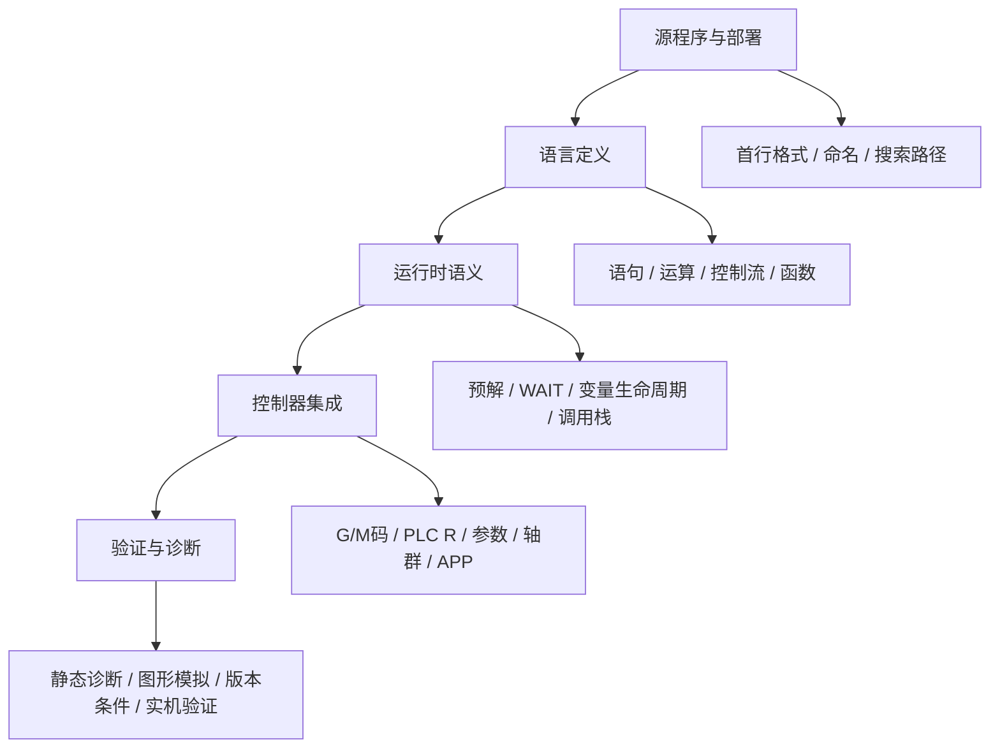

# Atlassian MACRO 知识记录

本文件记录通过 Atlassian MCP 检索并核实的新代官方资料，作为扩展开发、问题分析与后续资料查询的本地索引。

更新日期：2026-07-13

## 首轮知识框架

新代 MACRO 不能只按“关键字和函数”理解；其正确性同时由格式、控制器执行模型、变量作用域、运动语义与控制器版本决定。本仓库后续的语法支持和问题分析，统一按以下五层定位：

| 层级 | 需要回答的问题 | 首选证据 |
|---|---|---|
| 源程序与部署 | 这是 MACRO 吗？档名、路径、调用目标是否正确？ | 《MACRO开发应用手册》、档案与实际调用配置 |
| 语言定义 | 语句、变量、函数和控制流是否为合法写法？ | 《MACRO开发应用手册》、《Macro_Function_List》、《Macro变数规格》 |
| 运行时语义 | 变量何时生效？读取的数据是否已完成运动？调用是否隔离作用域？ | 《MACRO开发应用手册》、《Macro变数规格》 |
| 控制器集成 | 读写的系统变量、R、参数、I/O 是否在此版本与机型可用？ | 《Macro变数规格》、PLC/参数/驱动器专项手册 |
| 验证与诊断 | 规则能否由插件静态验证，还是必须图形模拟或实机确认？ | 扩展测试、图形模拟、诊断变量、实机记录 |

## 资料可信度与维护规则

| 等级 | 资料类型 | 可用于插件规则 | 处理方式 |
|---|---|---|
| A | TechManual 控制器正式手册、变量规格、函数表 | 可以，仍须附版本条件 | 摘要结论与 URL 写入本文或语法规范手册 |
| B | LTP 正式产品/机器人手册 | 可用于该产品范围 | 注明机型和版本，不能外推到通用 CNC |
| C | 内部编辑器、开发笔记、个人总结 | 仅作线索与交叉参考 | 不单独作为强诊断或语法真源 |
| D | 推断、未提供完整上下文的搜索片段 | 不可以 | 放入待验证清单，补到 A/B 来源后再升级 |

本次已将《MACRO开发应用手册》《Macro变数规格》与《Macro_Function_List》定为 A 级主来源。本文只保存归纳、版本边界和链接，不复制原始手册全文。

## 使用边界

- 本文是资料索引和规则摘要，不替代控制器版本对应的正式手册。
- 遇到版本、机型、功能选配或参数设定相关的问题，先打开来源页面确认适用版本与完整前置条件。
- 现有语法支持范围以本仓库的 `src/` 实现和测试为准；本文用于判断应否补充、修正或收紧该实现。

## 已核实的核心规则

### 文件格式与基础书写

| 主题 | 已核实规则 | 对扩展的影响 |
|---|---|---|
| MACRO 声明 | 首行须为 `%@MACRO`，否则控制器按 ISO 格式解读，无法使用完整 MACRO 语法。 | 保持首行判定与相关诊断。 |
| 分号 | ISO 行末可加可不加；MACRO 除特定语法外，每行须以 `;` 结束。 | 分号缺失应保留为 MACRO 上下文诊断。 |
| 注释 | 支持 `//` 单行注释与 `(* ... *)` 注释。 | 词法规则与格式化器须避免误解析注释内容。 |
| 文件大小 | 手册列出超过 60 KB（60,000 bytes）为限制条件。 | 这是控制器运行限制，当前扩展未做大小诊断；如添加，需提供可配置阈值并明确版本依据。 |

### 变量与调用作用域

| 变量/调用 | 已核实规则 | 实践含义 |
|---|---|---|
| 区域变量 | `#1` 至 `#400` 是区域变量；一般 MACRO 结束后会恢复为 `VACANT`。 | 不应把区域变量当成跨宏持久存储。 |
| 区域变量分区 | `#1` 至 `#26` 用于宏调用引数；`#27` 至 `#400` 用于宏程序及副程序区域变量。 | 维持参数映射提示，并避免将 `#1` 至 `#26` 误标为普通局部用途。 |
| 系统变量 | `#1000` 至 `#31986` 属系统变量。 | 读写性与版本依赖必须按《Macro变数规格》逐项确认。 |
| 公用变量 | `@1` 至 `@165535` 属公用变量。 | 使用前需确认具体编号的含义和读写权限，避免覆盖系统保留区域。 |
| `M98` / `M198` | 调用子程序并继承主程序的区域变量 `#1` 至 `#400`。 | 调用方与子程序共享局部状态，修改会影响后续主程序逻辑。 |
| `G65` | 调用单一宏程序时创建独立的 `#1` 至 `#400` 区域变量；引数写入 `#1` 至 `#26`。 | 适合封装可复用、带引数且不应污染调用方局部变量的逻辑。 |

### 副程序与宏程序调用

| 指令 | 格式和行为 |
|---|---|
| `M98 P_ H_ L_` | 调用子程序；`P` 为程序号，`H` 为起始 `N` 序号，`L` 为重复次数；需配合 `M99` 返回。 |
| `M198 P_ H_ L_` | 调用外部子程序；每次执行会重新开档读取子程序内容，适用于需要取得最新档案内容的情境。 |
| `G65 P_ L_` | 调用单一宏程序；`L` 仅对含有 `G65` 的该单节重复调用有效；字母引数依宏引数对照写入 `#1` 至 `#26`。 |
| `M99 P_` | 子程序返回；省略 `P` 时从 `M98` / `M198` 的下一行继续，指定 `P` 时可回到主程序指定 `N` 序号。 |
| `M02` / `M30` | 在子程序内执行时，视同子程序结束并回到主程序。 |

### 控制流与版本限制

| 主题 | 已核实规则 |
|---|---|
| 范围语法 | `IF`、`CASE`、`REPEAT`、`FOR`、`WHILE` 等范围语法在 10.120.32 及之后版本列为支持。 |
| 巢状上限 | `CASE`、`IF`、`REPEAT`、`WHILE`、`FOR` 可巢状组合，最大 10 层；超过会触发 `COM-007`。 |
| 性能 | 范围过大的控制流区间可能造成加工时轴向降速。 |
| 验证建议 | 加工前先执行图形模拟进行语法检查。 |

### 运行时：预解、同步与副作用

控制器会预解 MACRO，因此“代码写在运动指令之后”不等价于“运动完成后才执行”。这是分析加工异常时应优先检查的运行时语义。

| 主题 | 已核实规则 | 设计/排障意义 |
|---|---|---|
| 预解 | MACRO 的变量运算与资料读取会领先于实际 G/M 码动作。 | 运动后立即读坐标、状态或驱动器资料，可能取得旧值。 |
| `WAIT()` | 阻止继续预解，直到 `WAIT()` 之前的 G/M 码完成。 | 在读取依赖运动结果的数据之前加入 `WAIT()`。 |
| `WAIT()` 例外 | `M98`、`M99`、`M198` 不受 `WAIT()` 等待保证约束。 | 不要将 `WAIT()` 当作子程序执行完成的通用同步机制。 |
| 读取诊断资料 | `SYSDATA` 建议先 `WAIT()`；引数必须是整数且在诊断变量范围内。 | 参数形态与时序都应列入静态提示或运行前检查。 |
| 读取驱动器资料 | `DRVDATA` 对站号、驱动器类型和开机后资料就绪时间敏感。 | 不把 `VACANT` 或启动初期的错误直接当作机械状态结论。 |
| 无限循环 | 过深/过大范围语法会影响执行，循环不让出资源可能导致人机失去响应。 | 循环设计应有退出条件；在长期循环中评估 `SLEEP()`。 |

### 宏程序、子程序、Script 的边界

| 类型 | 启动时机 | 变量关系 | 核心边界 |
|---|---|---|---|
| 一般 MACRO | 由扩充 G/M/T、`G65`、`G66` 等调用 | 依调用方式决定独立或继承 `#1` 至 `#400` | 可使用加工、运动和 MACRO 语义；通常以 `M99` 返回。 |
| 子程序 | `M98` / `M198` 调用 | 继承父程序区域变量 | 适合共享父程序临时状态，但副作用必须显式管理。 |
| 常驻 Script | 控制器开机即运行 | 各 Script 独立，仅能透过 `@` 沟通 | 最多 8 个；由 OS 排程，不应假设档名决定先后顺序；不能用副程序调用语法执行。 |
| APP Macro | 位于 APP 指定路径并由 APP 调用 | 可使用独立 AR/MAR 空间 | AR/MAR 不能从一般 MACRO 路径直接存取。 |

## 从需求到验证的工作流

面对新语法、缺陷或用户问题时，按下列顺序处理，避免把控制器运行时问题误改成插件词法问题：

1. 判定载体：确认目标是一般 MACRO、子程序、常驻 Script、APP Macro 还是机器人程序。
2. 判定版本：记录控制器系列和版本；所有“支持/不支持”必须带版本。
3. 判定调用模型：确认调用指令、`P/H/L` 的含义、引数来源及区域变量是隔离还是继承。
4. 判定时序：若结果依赖运动、I/O、系统状态或驱动器资料，检查预解并评估 `WAIT()`。
5. 判定整合面：检查是否读写 R、参数、系统变量、AR/MAR 或机型专项功能。
6. 选择验证：纯语法用单元测试；跨档调用用集成测试；运动/时序/版本差异用图形模拟或实机验证。
7. 回写证据：将确认结论、来源、版本、样例和测试位置更新到语法规范手册或本文。

## 当前插件认知地图

| 主题 | 主要实现位置 | 当前认知 | 首轮后续动作 |
|---|---|---|---|
| 文件识别与格式 | `src/validator.js`、语法配置 | `%@MACRO` 决定 MACRO/ISO，是根规则。 | 确认首行与分号诊断是否完整覆盖。 |
| 控制流 | `src/controlFlowValidator.js`、`src/keywords.js` | 控制流结构可静态配对；嵌套上限和大文件性能属于运行时/版本语义。 | 评估是否增加超过 10 层的 warning，并避免无版本依据的 error。 |
| 函数 | `src/functions.js` | 函数说明包含有效版本，但需与官方函数表持续同步。 | 抽样审查函数签名、版本和 `WAIT()` 前置条件。 |
| 调用导航 | `src/navigationIndex.js`、`src/fileResolver.js` | 导航解析目标文件，不等价于控制器运行时的变量/时序正确性。 | 保持命名与路径规则和官方手册同步。 |
| 变量诊断 | `src/validator.js`、`src/diagnosticRules.js` | 变量语法可静态检查；开放区段、读写性、机型权限通常为版本相关。 | 优先补可静态判定的 `#0/@0` 写入和已知 R 保留区风险提示。 |
| 机器人语法 | `src/robotValidator.js`、`src/keywords.js` | 属 LTP/机器人专项能力，不能以通用 CNC 手册替代。 | 按机器人《语法指令规格》独立维护版本和测试。 |

## 待验证清单

以下内容已有仓库实现或资料线索，但尚未在本轮逐项以 A 级来源复核，不应据此贸然改变强诊断：

| 主题 | 当前状态 | 需要的证据 |
|---|---|---|
| 每个内置函数的签名、返回型别和版本 | 函数表已有实现，首轮只抽样核对 `SYSDATA`、`DRVDATA`、`GETARG`。 | 《Macro_Function_List》的逐函数页面或完整正式表。 |
| `G66/G66.1/G67` 模态宏的调用与区域变量细节 | 现有语法手册有整理，首轮未逐行复核。 | 《MACRO开发应用手册》对应章节与版本条件。 |
| 公用变量/R 映射的所有可写区间 | 现有手册较完整，但强依控制器系统与配置。 | 《Macro变数规格》加 PLC/控制器型号条件。 |
| 60 KB 以上档案的实际行为 | 已核实 10.120.32+ 支持范围语法；细节仍依版本。 | 目标控制器版本的手册与图形模拟/实机测试。 |
| 机器人 MOV 指令和替代语法 | 已有 LTP 语法页面，尚未做逐条对应。 | 《语法指令规格》与版本矩阵。 |
| 控制器诊断变量效能阈值 | 仓库语法手册含部分指标，首轮未逐项对照。 | 《控制器诊断变数》相关变量条目与实机量测。 |

## 与本仓库的对应关系

| 官方规则 | 仓库位置 |
|---|---|
| `%@MACRO` 格式判定、变量与控制流概览 | [新代宏程序知识图谱](新代宏程序知识图谱.md) |
| 实际语言诊断与规则 | `src/validator.js`、`src/controlFlowValidator.js`、`src/diagnosticRules.js` |
| 函数签名与说明 | `src/functions.js` |
| 关键字和补全 | `src/keywords.js`、`src/completionSnippets.js` |
| 用户可见的诊断说明 | [诊断规则与修复动作](诊断规则与修复动作.md) |

## 已检索来源

以下为本次 MCP 可访问且实际用于摘要的页面。相同标题可能在简体、繁体或不同空间中有镜像；优先采用 TechManual 空间的版本。

1. [MACRO开发应用手册](https://syntecclub.atlassian.net/wiki/spaces/TechManual/pages/44106050/MACRO)：文件格式、注释、控制流、调用与运行限制的主来源。
2. [Macro变数规格](https://syntecclub.atlassian.net/wiki/spaces/TechManual/pages/44106246/Macro)：区域、系统、公用变量范围、生命周期、读写规格与版本条件。
3. [G65：单一宏程序程式呼叫](https://syntecclub.atlassian.net/wiki/spaces/TechManual/pages/44112481/G65)：`G65` 调用格式与字母引数映射示例。
4. [M码指令说明](https://syntecclub.atlassian.net/wiki/spaces/TechManual/pages/44107225/M)：`M98`、`M99`、`M198` 与子程序结束行为。
5. [新代Macro轻量编辑器](https://syntecclub.atlassian.net/wiki/spaces/SZJS/pages/810777362/Macro)：内部编辑器的已实现功能记录，仅作交叉参考，不作为控制器语法规范。

## 后续查询约定

- 先用 Rovo 搜索定位页面；只有需要精确筛选时才使用 CQL/JQL。
- 回答或修改语法支持前，至少记录来源 URL、控制器版本条件和是否为控制器正式规范。
- 新发现写入本文时，追加“更新日期、结论、来源、适用范围”；不复制整篇受版权保护的手册内容。