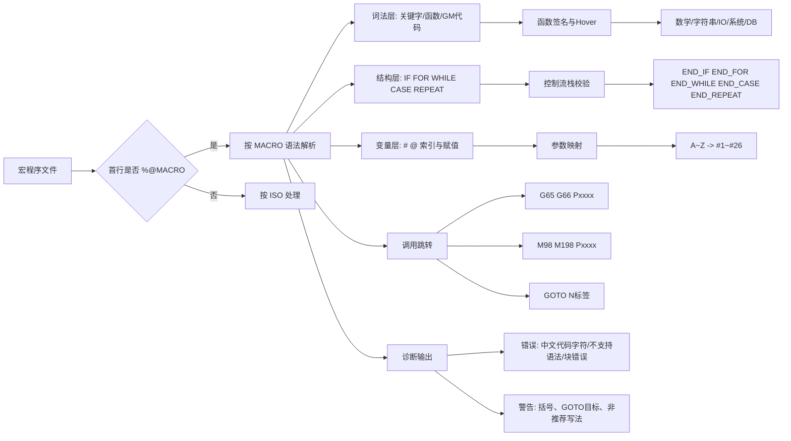

# 新代宏程序知识图谱

本图谱用于快速理解新代 MACRO 的核心知识结构，并与本仓库的语法实现保持一致。

数据来源：
- docs/新代MACRO语法规范手册.md
- src/functions.js
- src/keywords.js
- src/validator.js
- src/controlFlowValidator.js

## 1. 总览图（Mindmap）

```mermaid
mindmap
  root((新代宏程序 Syntec Macro))
    文件与执行
      首行判定
        %@MACRO -> MACRO格式
        非%@MACRO -> ISO格式
      文件命名
        扩充G码
          G200 -> G0200
          G200.1 -> G200001
        O码副程序
          O8000
      路径优先级
        NCFILES 优先
        MACRO 次之
      执行机制
        预解与运动分离
        WAIT 阻挡预解
    变量系统
      区域变量
        '#0 VACANT'
        '#1~#26 参数映射'
        '#27~#400 一般用途'
      索引写法
        '#1'
        '#[表达式]'
      建议
        赋值优先 ':='
        '=' 用于比较
    控制流
      IF THEN ELSEIF ELSE END_IF
      FOR TO BY DO END_FOR
      WHILE DO END_WHILE
      REPEAT UNTIL END_REPEAT
      CASE OF ELSE END_CASE
      GOTO EXIT PAUSE
    内置函数
      数学函数
        ABS SIN COS TAN SQRT
        EXP LN POW MAX MIN
      字符串
        STR2INT SCANTEXT
      资料读取
        GETARG PARAM SYSVAR SYSDATA
      IO
        READDI READDO SETDO
      文件
        OPEN PRINT CLOSE
      系统与节流
        MSG ALARM WAIT SLEEP
      数据库
        DBOPEN DBNEW DBLOAD DBSAVE DBINSERT DBDELETE
    G/M 代码与跳转
      G65 G66 G66.1
      M98 M198
      N标签
        GOTO 100 -> N100
      includePath 扩展搜索
    诊断规则
      结构配对
        缺少 END_*
        嵌套顺序错误
      语法不支持
        ELSIF
        DEFAULT
        DIV
      字符与格式
        代码区中文字符/中文标点
        括号不匹配
      静态检查
        GOTO 目标不存在
        推荐结尾关键字
```

## 2. 语法到能力映射图



## 3. 常用速查表

| 维度 | 核心点 | 典型元素 |
|---|---|---|
| 文件入口 | 是否为 MACRO 文件 | `%@MACRO` |
| 控制流 | 成对结束与嵌套顺序 | `IF...END_IF`, `FOR...END_FOR` |
| 变量 | 参数映射与区域变量 | `#1~#26`, `#27~#400`, `#0` |
| 函数 | 计算、系统、IO、数据库 | `ABS`, `GETARG`, `WAIT`, `READDI`, `DBOPEN` |
| 跳转 | 程序间调用与标签跳转 | `G65/G66`, `M98/M198`, `GOTO Nxxx` |
| 诊断 | 实时规则检查 | 缺失 `END_*`、`ELSIF`、中文代码字符 |

## 4. 维护建议

- 当新增函数时：同步更新 src/functions.js 与本图谱的“内置函数”节点。
- 当新增关键字时：同步更新 src/keywords.js 与“控制流/语法映射图”。
- 当新增诊断规则时：同步更新 src/validator.js、src/controlFlowValidator.js 与“诊断规则”节点。
