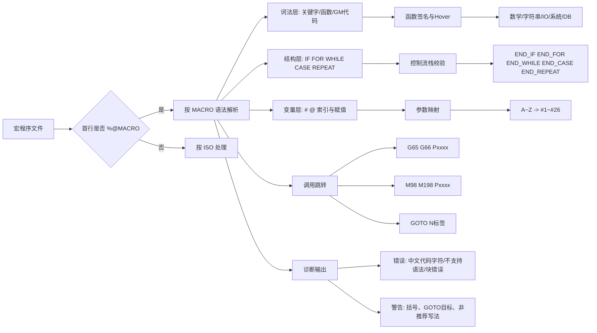

# 新代宏程序知识图谱

本图谱用于快速理解新代 MACRO 的核心知识结构和本扩展的能力边界。

它是概念导航，不维护完整函数签名、诊断清单、控制器版本或运行时结论。具体规则以 [新代 MACRO 语法规范手册](新代MACRO语法规范手册.md)、[MACRO 能力矩阵](macro-knowledge/MACRO能力矩阵.md) 和 [诊断规则与修复动作](诊断规则与修复动作.md) 为准。

## 1. 总览图（Mindmap）

```mermaid
mindmap
  root((新代宏程序 Syntec Macro))
    文件与执行
      首行判定
        %@MACRO -> MACRO格式
        非%@MACRO -> ISO格式
      文件命名
        扩充G码
          G200 -> G0200
          G200.1 -> G200001
        O码副程序
          O8000
      路径优先级
        NCFILES 优先
        MACRO 次之
      执行机制
        预解与运动分离
        WAIT 阻挡预解
    变量系统
      区域变量
        '#0 VACANT'
        '#1~#26 参数映射'
        '#27~#400 一般用途'
      索引写法
        '#1'
        '#[表达式]'
      建议
        赋值优先 ':='
        '=' 用于比较
    控制流
      IF THEN ELSEIF ELSE END_IF
      FOR TO BY DO END_FOR
      WHILE DO END_WHILE
      REPEAT UNTIL END_REPEAT
      CASE OF ELSE END_CASE
      GOTO EXIT PAUSE
    内置函数
      数学与转换
      字符串与资料读取
      IO与寄存器
      文件与Cycle资料库
      系统控制与节流
      图形模拟与单位堆栈
    G/M 代码与跳转
      G65 G66 G66.1
      M98 M198
      N标签
        GOTO 100 -> N100
      includePath 扩展搜索
    诊断规则
      结构配对
      分号与不支持语法
      字符与格式
      变量与函数参数
      机器人与应用限制
```

## 2. 语法到能力映射图



## 3. 能力导航

| 维度 | 用途 | 权威入口 |
|---|---|---|
| 基础语法 | 文件格式、变量、控制流、调用及机器人语法 | [新代 MACRO 语法规范手册](新代MACRO语法规范手册.md) |
| 当前能力与边界 | 官方基线、插件覆盖、审计状态和后续验证 | [MACRO 能力矩阵](macro-knowledge/MACRO能力矩阵.md) |
| 诊断与修复 | 稳定诊断 code、严重度、Quick Fix 与说明型 CodeAction | [诊断规则与修复动作](诊断规则与修复动作.md) |
| 证据与实施规划 | 来源分级、阶段门禁、能力任务和验证策略 | [MACRO 知识与验证规划](macro-knowledge/MACRO知识与验证规划.md) |
| 调用与运行时边界 | 宏调用、变量生命周期、`WAIT()` 与动态目标 | [MACRO 调用语义资料包](macro-knowledge/MACRO调用语义资料包.md) |
| 函数专题证据 | 系统控制、Cycle、图形模拟、单位与堆栈函数 | [MACRO 知识库](macro-knowledge/README.md) |

## 4. 使用与维护

- 图谱只在概念分类或阅读路径变化时更新，不按函数、关键字或诊断逐项同步。
- 新增或修改语法规则时，更新语法规范手册、能力矩阵、实现与测试。
- 新增或修改诊断时，更新诊断元数据并执行 `npm.cmd run docs:diagnostics`，由生成文档维护完整规则表。
- 新增证据或运行时结论时，更新对应资料包与能力矩阵；后续实施顺序以知识与验证规划为准。
